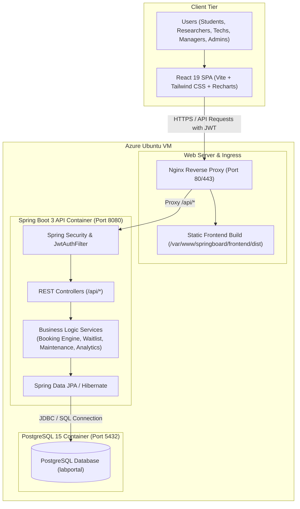
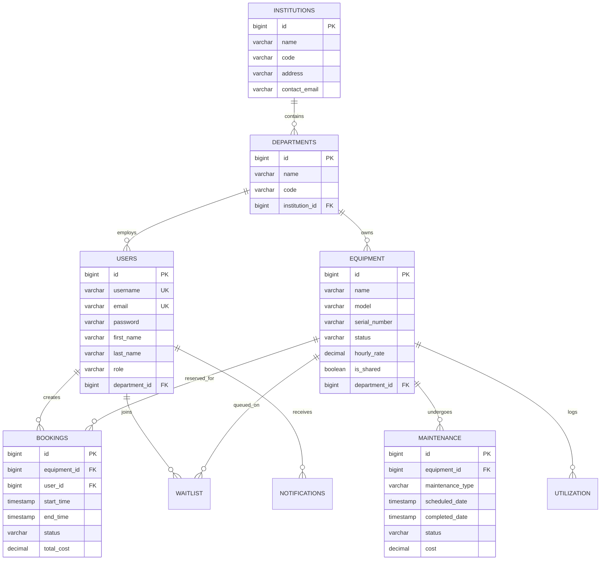

# Lab Equipment & Resource Utilization Platform

A full-stack web application designed for academic and research institutions to manage laboratory equipment inventory, handle reservations without scheduling conflicts, manage waitlists, track preventive maintenance and calibrations, and monitor resource utilization.

Deployed on **Microsoft Azure VM** with an **Nginx** reverse proxy.

---

## Table of Contents
1. [Overview](#overview)
2. [Tech Stack](#tech-stack)
3. [System Architecture](#system-architecture)
4. [Implemented Features](#implemented-features)
5. [Milestones Breakdown](#milestones-breakdown)
6. [Database Schema](#database-schema)
7. [Role-Based Access Control (RBAC)](#role-based-access-control-rbac)
8. [API Endpoints](#api-endpoints)
9. [Local Setup Instructions](#local-setup-instructions)
10. [Azure Cloud Deployment](#azure-cloud-deployment)
11. [Testing](#testing)

---

## Overview

In academic institutions and research centers, laboratory equipment like Spectrophotometers, Electron Microscopes, and High-Performance Workstations are shared across multiple departments and student cohorts. Managing these resources manually often results in:
- Double bookings and scheduling conflicts.
- Equipment downtime caused by unmonitored maintenance and calibration cycles.
- Low visibility into actual machine usage across departments.
- Difficulty in sharing specialized equipment with partner colleges or external researchers.

This platform provides a centralized system where students and researchers can book equipment, lab technicians can log work orders, and department heads/managers can monitor utilization and inter-institution billing.

---

## Tech Stack

| Layer | Technologies |
| :--- | :--- |
| **Frontend** | React 19, Vite, Tailwind CSS, Recharts, Lucide Icons, React Router v7, Axios, React Hot Toast |
| **Backend** | Java 17, Spring Boot 3.2.5, Spring Security, Spring Data JPA, Hibernate, Lombok, JJWT (0.12.5), Maven |
| **Database** | PostgreSQL 15, H2 (for tests) |
| **Containerization** | Docker, Docker Compose |
| **Cloud & Server** | Microsoft Azure Ubuntu VM, Nginx (Reverse Proxy & Static Asset Server) |
| **Testing** | JUnit 5, Mockito, Spring Security Test |

---

## System Architecture



---

## Implemented Features

### 1. Multi-Institution & Department Hierarchy
- Multi-tier data model linking **Institutions ➔ Departments ➔ Equipment**.
- Supports both internal departmental use and cross-institutional sharing.

### 2. Authentication & Authorization (RBAC)
- Stateless authentication using signed JSON Web Tokens (JWT).
- BCrypt password hashing.
- 7 user roles with custom permissions:
  - `STUDENT`, `RESEARCHER`, `LAB_TECHNICIAN`, `LAB_MANAGER`, `DEPARTMENT_HEAD`, `INSTITUTION_HEAD`, `SYSTEM_ADMIN`.

### 3. Equipment Catalog & Status Tracking
- Searchable equipment directory with status tags (`AVAILABLE`, `IN_USE`, `UNDER_MAINTENANCE`, `CALIBRATION_PENDING`, `DECOMMISSIONED`).
- Stores equipment details, serial numbers, location, hourly rates, and specifications.

### 4. Booking & Conflict Prevention Engine
- Validation algorithm on the backend checking for slot overlaps `(startTime < requestedEnd AND endTime > requestedStart)`.
- Prevents double bookings for the same machine.
- Automatic booking cost calculation based on duration and hourly rates.

### 5. Priority Waitlist
- When equipment is currently reserved, students and researchers can queue into a waitlist.
- Lab managers can review and promote waitlisted requests when slots open up.

### 6. Maintenance & Calibration Management
- Preventive and corrective maintenance work orders.
- Calibration schedule and certificate expiry tracking.
- Automatic status update: setting equipment to `UNDER_MAINTENANCE` locks it from being booked.

### 7. Utilization Analytics Dashboard
- Key metrics: Total equipment count, utilization rate, total booked hours, and maintenance downtime.
- Charts for equipment usage by department and month using Recharts.
- Inter-institution billing view to track fees for external researcher bookings.

### 8. Notifications
- In-app notification alerts for booking approvals, rejections, cancellations, and maintenance updates.

---

## Milestones Breakdown

### Milestone 1 (Weeks 1 & 2): Project Setup, Database Schema & Authentication
- Initialized Spring Boot REST backend and React Vite frontend.
- Created PostgreSQL database schema and seed data.
- Configured Spring Security, BCrypt hashing, and JWT filter pipeline.
- Implemented core CRUD endpoints for institutions, departments, and equipment.

### Milestone 2 (Weeks 3 & 4): Booking Engine, Conflict Prevention & Waitlist
- Built booking system with backend time-overlap conflict detection.
- Developed waitlist queue system for busy equipment.
- Added support for cross-institution sharing flags on equipment.

### Milestone 3 (Weeks 5 & 6): Maintenance, Calibration & Analytics
- Implemented maintenance work orders and calibration certificate tracking.
- Added automated status transitions when equipment goes into maintenance.
- Built analytics dashboard with usage statistics and Recharts graphs.
- Added in-app notification center.

### Milestone 4 (Weeks 7 & 8): Dockerization, Azure Deployment & Testing
- Containerized the application using Docker and Docker Compose.
- Deployed on an Azure Ubuntu Linux VM with Nginx reverse proxy.
- Created unit tests and end-to-end integration test suites for core workflows.

---

## Database Schema



---

## Role-Based Access Control (RBAC)

| Feature / Page | `STUDENT` | `RESEARCHER` | `LAB_TECHNICIAN` | `LAB_MANAGER` | `DEPT_HEAD` | `INST_HEAD` | `SYSTEM_ADMIN` |
| :--- | :---: | :---: | :---: | :---: | :---: | :---: | :---: |
| **Dashboard & Profile** | Yes | Yes | Yes | Yes | Yes | Yes | Yes |
| **Equipment Catalog & Details** | Yes | Yes | Yes | Yes | Yes | Yes | Yes |
| **Create Booking Request** | Yes | Yes | No | Yes | No | No | Yes |
| **View My Bookings** | Yes | Yes | Yes | Yes | Yes | Yes | Yes |
| **Approve / Reject Bookings & Invoices** | No | No | No | Yes | Yes | Yes | Yes |
| **Join Waitlist Queue** | Yes | Yes | No | No | No | No | No |
| **Approve Waitlist Entries** | No | No | No | Yes | No | No | Yes |
| **Maintenance Work Orders** | No | No | Yes | Yes | No | No | Yes |
| **Calibrations & Compliance** | No | No | Yes | Yes | Yes | Yes | Yes |
| **Analytics Dashboard** | No | No | No | Yes | Yes | Yes | Yes |
| **User Management** | No | No | No | Yes | Yes | Yes | Yes |
| **Department Management** | No | No | No | No | No | Yes | Yes |
| **Institution Management** | No | No | No | No | No | No | Yes |

---

## API Endpoints

### Auth (`/api/auth`)
- `POST /api/auth/register` — Register a new account.
- `POST /api/auth/login` — Login and receive JWT token.

### Equipment (`/api/equipment`)
- `GET /api/equipment` — List all equipment with filter parameters.
- `GET /api/equipment/{id}` — Get single equipment details.
- `POST /api/equipment` — Add new equipment (Lab Manager / Admin).
- `PUT /api/equipment/{id}` — Update equipment details or status.
- `DELETE /api/equipment/{id}` — Remove equipment.

### Bookings (`/api/bookings`)
- `GET /api/bookings` — Fetch all bookings (Manager view).
- `GET /api/bookings/my` — Fetch current user's bookings.
- `POST /api/bookings` — Submit a booking request with conflict check.
- `PUT /api/bookings/{id}/approve` — Approve pending booking.
- `PUT /api/bookings/{id}/reject` — Reject pending booking.
- `PUT /api/bookings/{id}/cancel` — Cancel booking.
- `PUT /api/bookings/{id}/billing` — Update cross-institution billing status (`BILLED`, `PAID`).

### Waitlist (`/api/waitlist`)
- `GET /api/waitlist` — Fetch active waitlist entries.
- `POST /api/waitlist` — Join waitlist for equipment.
- `PUT /api/waitlist/{id}/approve` — Promote waitlist entry to booking.
- `PUT /api/waitlist/{id}/cancel` — Cancel waitlist request.

### Maintenance (`/api/maintenance`)
- `GET /api/maintenance` — Fetch all maintenance and calibration records.
- `POST /api/maintenance` — Create a new maintenance task.
- `PUT /api/maintenance/{id}` — Update task status and cost.

### Analytics (`/api/utilization`)
- `GET /api/utilization/metrics` — Overall utilization rate and hours summary.
- `GET /api/utilization/heatmap` — Department-wise and equipment-wise breakdown.

---

## Local Setup Instructions

### Option 1: Run with Docker Compose (Fastest)

```bash
# Clone the repository
git clone https://github.com/akash3911/springboard.git
cd springboard

# Start all containers
docker compose up -d --build
```

- **Frontend:** `http://localhost:5173`
- **Backend API:** `http://localhost:8080/api`
- **PostgreSQL:** `localhost:5432`

---

### Option 2: Run Manually

#### 1. Start PostgreSQL
Create a database named `labportal`:
```sql
CREATE DATABASE labportal;
```

#### 2. Start Backend
```bash
cd backend
mvn clean spring-boot:run
```
Runs on `http://localhost:8080`.

#### 3. Start Frontend
```bash
cd frontend
npm install
npm run dev
```
Runs on `http://localhost:5173`.

---

## Azure Cloud Deployment

The application is deployed on a **Microsoft Azure Linux VM (Ubuntu 22.04 LTS)** using **Nginx** as a reverse proxy.

### Setup Overview:
1. **Azure VM**: Hosts the backend, frontend static files, and database.
2. **Network Security Group**: Open inbound ports `80` (HTTP), `443` (HTTPS), and `22` (SSH).
3. **Nginx Configuration**: Routes `/api/*` requests to the Spring Boot application on port 8080, and serves the React production build (`frontend/dist`) for all web requests.

#### Nginx Site Configuration (`/etc/nginx/sites-available/springboard`):

```nginx
server {
    listen 80;
    server_name your-domain-or-azure-ip;

    gzip on;
    gzip_types text/plain text/css application/json application/javascript text/xml;

    # Backend API Proxy
    location /api/ {
        proxy_pass http://127.0.0.1:8080/api/;
        proxy_set_header Host $host;
        proxy_set_header X-Real-IP $remote_addr;
        proxy_set_header X-Forwarded-For $proxy_add_x_forwarded_for;
        proxy_set_header X-Forwarded-Proto $scheme;
    }

    # Frontend Single Page App
    location / {
        root /var/www/springboard/frontend/dist;
        try_files $uri $uri/ /index.html;
    }
}
```

---

## Testing

The project includes unit and integration tests covering the core services and workflow logic:

```bash
cd backend
mvn test
```

### Key Integration Tests:
- `AuthenticationWorkflowIntegrationTest`: Verifies JWT issuance, valid authentication, and rejection of invalid credentials.
- `BookingAndWaitlistWorkflowIntegrationTest`: Tests booking slot validation, collision detection, and waitlist promotion.
- `EquipmentLifecycleWorkflowIntegrationTest`: Validates equipment status transitions across available, reserved, and maintenance states.
- `MultiInstitutionBillingWorkflowIntegrationTest`: Validates cost calculations for cross-departmental bookings.
